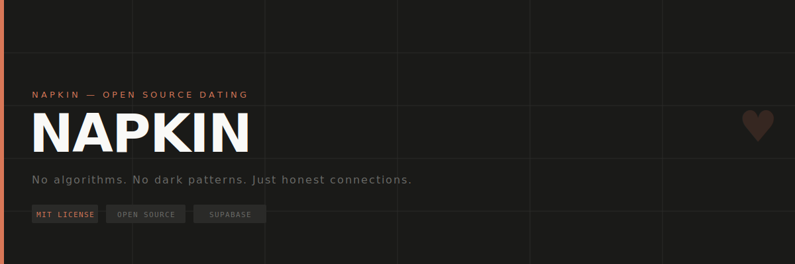

# NAPKIN

> A transparent, open-source dating platform built for college students. No black-box algorithms, no dark patterns — just honest profiles and real conversations.

---

## Stack

- **Frontend** — Vanilla HTML, CSS, IBM Plex Mono
- **Backend** — [Supabase](https://supabase.com) (Auth, Database, Storage)
- **Hosting** — GitHub Pages / any static host

---

## Pages

| Page | Description |
|------|-------------|
| `index.html` | Landing page |
| `auth.html` | Login |
| `join.html` | Multi-step signup |
| `browse.html` | Browse profiles |
| `matches.html` | Matches & chat |
| `likes.html` | Profiles you liked |
| `profile.html` | Your profile & settings |

---

## Setup

### 1. Supabase

Create a project at [supabase.com](https://supabase.com), then run `setup.sql` in the SQL Editor:

```sql
-- creates profiles, matches, messages tables with RLS policies
```

### 2. Storage

Run this in SQL Editor to enable avatar uploads:

```sql
insert into storage.buckets (id, name, public) values ('avatars', 'avatars', true)
  on conflict do nothing;

create policy "Anyone can view avatars" on storage.objects
  for select using (bucket_id = 'avatars');

create policy "Users can upload own avatar" on storage.objects
  for insert with check (bucket_id = 'avatars' and auth.uid()::text = (storage.foldername(name))[1]);

create policy "Users can update own avatar" on storage.objects
  for update using (bucket_id = 'avatars' and auth.uid()::text = (storage.foldername(name))[1]);
```

### 3. Config

Update the Supabase URL and anon key in each HTML file:

```js
const sb = createClient(
    'https://YOUR_PROJECT.supabase.co',
    'YOUR_ANON_KEY'
);
```

### 4. Auth Settings

In Supabase → Authentication → Providers → Email:
- Disable **"Confirm email"** for instant signup

---

## Features

- Email auth (signup / login)
- Profile creation with name, age, college, bio, avatar
- Browse other users' profiles
- Like profiles — saved to database
- Send first message from browse page
- Real-time-style matches & chat
- Notification bell for new likes and messages
- Unmatch with confirmation
- Profile editing
- Mobile responsive

---

## License

MIT — free to use, fork, and build on.
